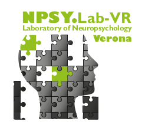
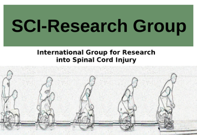

# 

## Short bio and Research Interests

I am a researcher in the neuroscience field, interested in body, action, space
and time representations, and their influences on cognition
at the [NPSY-Lab.VR][1], [University of Verona][UniVR].

<!--more-->

In particular, my research work is focused on patients with a spinal cord lesion,
people that are experiencing in their everyday life a body-brain disconnection
from both the sensorial and motor functionality. I finished my PhD in 2015 in
Social and Affective Neuroscience at the University “La Sapienza” or Rome
(Italy) of [prof. Salvatore M. Aglioti][2], under the
supervision of [prof. Valentina Moro][3].

![][myself]

## Research groups

### Laboratory of Neuropsychology in Verona (NPSY-Lab.VR)

I am member of the ["Laboratory of Neuropsychology of Verona"][1],
headed by prof. Valentina Moro.

The main topic of this laboratory is the neuropsychological research,
primarily on patients who suffered from Central Nervous System lesions,
but extended to patients affected by neurodegenerative diseases
and peripheral loss.

Central to the experimental efforts of the [NPSY-Lab.VR][1] is the Awareness,
in all its forms.

- The awareness for our own disabilities, such as "Anosognosia for Hemiplegia"
(AHP) [^1], "Anosognosia for Apraxia" [^2] [^3], "Anosognosia for Theory of Mind",
"Anosognosia for Amnesia"
- The body awareness, that may be seen as the awareness of others' body [^4], or
the awareness of our own body [^5]
- further aspects concerning awareness [^6]

### International Research Group into Spinal Cord Injuries (SCI-Research Group)

Prof. Valentina Moro and me are co-coordinating,
the [“International Research Group into Spinal Cord Injuries”][SCI-ResearchGroup].

The purpose of this group is to create a network between European
spinal units and research laboratories, to study the relationship
between body and cognition in spinal cord injured people,
with a double aim:

- designing new cognitive exercises that may be helpful in rehabilitative
  trainings [^7] [^8] [^9]
- in-depth study of body representations [^10] [^11]

### *Ba*yesian *S*tatistics *I*n *C*ognitive Sciences and *N*euro*psy*chology (BASIC-NPSY)

Bayesian Statistics is one field of my expertise. I coordinate the
[BASIC-NPSY Research Group][BASIC-NPSY] and I have organized a
summer school concerning [Bayesian statistics, "Bayesian Statistics for the Human, Social and Cognitive sciences - BayesHSC"][BayesHSC].

The main goal of the [BASIC-NPSY Research Group][BASIC-NPSY] is to spread
the knowledge of Bayesian Inference techniques in the many subfields of the
neuroscientific and neuropsychological science.

## Teaching

I teach at the [University of Verona][UniVR] [“Neuroscience of Learning”][learning]
and the laboratory [“Body and disability”][labdisability].

Both courses are based on the notion of neuroplasticity from different perspectives.

**Office hours**: all mondays, from 9 to 11 am on [Zoom](https://univr.zoom.us/j/489282176)

I am both teacher and director of the [BayesHSC][BayesHSC] Summer School, and occasionally
I give lectures concerning Multilevel Models and Bayesian Statistics in PhD
programs.

## Collaborations

- [Valentina Moro](https://sites.hss.univr.it/npsy-labvr/valentina-moro/)
- [Salvatore M. Aglioti](https://agliotilab.org/lab-staff/principal-investigator)
- [Katerina Fotopoulou](https://www.fotopoulou.com/katerina-fotopoulou/)
- [Paul Jenkinson](https://researchprofiles.herts.ac.uk/portal/en/persons/paul-jenkinson(841e694a-de68-41cc-864a-6cb7d0efd3f7).html)
- [Daniele L. Romano](https://labmaravitabicocca.wixsite.com/maravita-lab-bicocca/about-us)
- [Emmanuele Tidoni](https://www.hutechlab.com/)
- [Marco Tullio Liuzza](https://sites.google.com/view/marcotullioliuzza/)
- [Gabriele Fusco](https://agliotilab.org/lab-staff/senior-fellows/gabriele-fusco)

## References

[1]: http://sites.hss.univr.it/npsy-labvr/
[2]: https://agliotilab.org/lab-staff/principal-investigator
[3]: https://michelescandola.github.io/www.dsu.univr.it/?ent=persona&id=2097
[Univr]: https://www.univr.it
[SCI-ResearchGroup]: https://sites.hss.univr.it/npsy-labvr/spinal-cord-injury-research-center/
[BASIC-NPSY]: https://sites.hss.univr.it/npsy-labvr/basic-npsy-research-group/
[BayesHSC]: https://sites.hss.univr.it/bayeshsc/
[learning]: https://www.dsu.univr.it/?ent=oi&aa=2020%2F2021&codiceCs=W24&codins=4S007362&cs=861&discr=&discrCd=
[labdisability]: https://www.dsu.univr.it/?ent=oi&aa=2020%2F2021&codiceCs=W23&codins=4S000871&cs=360&discr=&discrCd=
[myself]: ../assets/images/myself_real_work.jpg "This may actually be me, working at home, during the COVID-19 Italian lockdown"

[^1]: Moro, V. (2013). The interaction between implicit and explicit awareness in anosognosia: Emergent awareness. Cognitive Neuroscience, 4(3–4), 199–200. https://doi.org/10.1080/17588928.2013.853656
[^2]: Canzano, L., Scandola, M., Pernigo, S., Aglioti, S. M., & Moro, V. (2014). Anosognosia for apraxia: Experimental evidence for defective awareness of one’s own bucco-facial gestures. Cortex, 61(0), 148–157. https://doi.org/10.1016/j.cortex.2014.05.015
[^3]: Scandola, M., Canzano, L., Avesani, R., Leder, M., Bertagnoli, S., Gobbetto, V., Aglioti, S. M., & Moro, V. (2020). Anosognosia for Limb and Bucco-facial apraxia as inferred from the recognition of gestural errors. Journal of Neuropsychology, in press.
[^4]: Moro, V., Pernigo, S., Avesani, R., Bulgarelli, C., Urgesi, C., Candidi, M., & Aglioti, S. M. (2012). Visual body recognition in a prosopagnosic patient. Neuropsychologia, 50(1), 104–117. https://doi.org/10.1016/j.neuropsychologia.2011.11.004
[^5]: Pernigo, S., Moro, V., Avesani, R., Miatello, C., Urgesi, C., & Aglioti, S. M. (2012). Massive somatic deafferentation and motor deefferentation of the lower part of the body impair its visual recognition: a psychophysical study of patients with spinal cord injury. The European Journal of Neuroscience, 36(11), 3509–3518. https://doi.org/10.1111/j.1460-9568.2012.08266.x
[^6]: Moro, V., Condoleo, M. T., Sala, F., Pernigo, S., Moretto, G., & Gambina, G. (2012). Cognitive stimulation in a-{MCI:} an experimental study. American Journal of Alzheimer’s Disease and Other Dementias, 27(2), 121–130. https://doi.org/10.1177/1533317512441386
[^7]: Scandola, M., Aglioti, S. M., Lazzeri, G., Avesani, R., Ionta, S., & Moro, V. (2020). Visuo-motor and interoceptive influences on peripersonal space representation following spinal cord injury. Scientific Reports, 10(1), 1–16. https://doi.org/10.1038/s41598-020-62080-1
[^8]: Scandola, M., Dodoni, L., Lazzeri, G., Arcangeli, C. A., Avesani, R., Moro, V., & Ionta, S. (2019). Neurocognitive Benefits of Physiotherapy for Spinal Cord Injury. Journal of Neurotrauma, neu.2018.6123. https://doi.org/10.1089/neu.2018.6123
[^9]: Scandola, M., Aglioti, S. M., Bonente, C., Avesani, R., & Moro, V. (2016). Spinal cord lesions shrink peripersonal space around the feet, passive mobilization of paraplegic limbs restores it. Scientific Reports, 6(April), 24126. https://doi.org/10.1038/srep24126
[^10]: Scandola, M., Togni, R., Tieri, G., Avesani, R., Brambilla, M., Aglioti, S. M., & Moro, V. (2019). Embodying their own wheelchair modifies extrapersonal space perception in people with spinal cord injury. Experimental Brain Research, 237(10), 2621–2632. https://doi.org/10.1007/s00221-019-05618-8
[^11]: Scandola, M., Aglioti, S. M., Avesani, R., Bertagnoni, G., Marangoni, A., & Moro, V. (2017). Corporeal Illusions in Chronic Spinal Cord Injuries. Consciousness and Cognition, 49, 278–290. https://doi.org/10.1016/j.concog.2017.01.010
